# 基于机器视觉的人脸识别与运动追踪

## 1. 概览

本项目实现了一个实时人脸检测与追踪系统。项目地址：[https://github.com/UJS-IoT2023/FaceTracking](https://github.com/UJS-IoT2023/FaceTracking)。

### 1.1 技术栈与环境

- **训练阶段**：使用 Python、PyTorch 和 Ultralytics YOLOv8 进行模型训练，依赖 uv 管理环境。
- **部署阶段**：使用 C++、LibTorch（PyTorch C++ API）和 OpenCV 进行高性能推理，可选 CUDA 加速。

### 1.2 主要流程

首先利用 PyTorch 通过迁移学习训练一个基于 YOLOv8n 的人脸目标检测模型，测试无误之后导出到 TorchScript 模型中供 C++ 部署时使用。C++ 通过 LibTorch 包装出一个检测器类，得出原始检测结果。同时在 C++ 中实现一个追踪器类，结合卡尔曼滤波和匈牙利算法，实现对检测结果的跨帧关联，使程序具备对运动人脸的稳定追踪功能。

## 2. 算法解释

### 2.1 目标检测算法

#### 2.1.1 Haar 级联检测器

在实验要求中，提到了通过 OpenCV 自带的 Haar 级联检测器来进行人脸的检测。此算法是 OpenCV 最经典，使用最广泛的传统方法，由 Viola 和 Jones 在 2001 年提出。它利用 Haar-like 特征（类似于黑白矩阵对比）来识别物体。

**Haar-like 特征**：Haar-like 特征是一组矩形模板，通过计算图像中相邻矩形区域内像素和的差值来提取特征。基本的 Haar-like 特征包括边缘特征、线性特征、中心环绕特征等。对于图像中任一子窗口，特征值 $f$ 定义为：

$$
f = \sum_{\text{white pixels}} I(x, y) - \sum_{\text{black pixels}} I(x, y)
$$

其中 $I(x, y)$ 表示像素点 $(x, y)$ 的灰度值。该特征能够捕捉图像中亮度变化的模式，例如人脸区域通常具有眼睛比脸颊暗、鼻梁比两侧亮等特征。

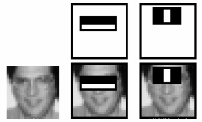

**积分图（Integral Image）**：为了快速计算任意矩形区域的像素和，Viola-Jones 算法引入了积分图。积分图 $I_\Sigma(x, y)$ 定义为从图像左上角到点 $(x, y)$ 所围矩形区域内所有像素灰度值之和：

$$
I_\Sigma(x, y) = \sum_{x' \le x, y' \le y} I(x', y')
$$

利用积分图，任意矩形区域的像素和可以在常数时间内计算，大大加速了特征提取过程。

**AdaBoost 分类器**：算法使用 AdaBoost 算法从大量 Haar-like 特征中筛选出少数关键特征，并构建一个强分类器。每个弱分类器 $h_j(x)$ 对应一个 Haar-like 特征 $f_j$ 和一个阈值 $\theta_j$：

$$
h_j(x) = 
\begin{cases}
1, & \text{if } p_j f_j(x) < p_j \theta_j \\
0, & \text{otherwise}
\end{cases}
$$

其中 $p_j \in \{+1, -1\}$ 用于控制不等式方向。AdaBoost 通过迭代调整样本权重，使得错误分类的样本在后续迭代中获得更高权重，最终强分类器为弱分类器的线性组合：

$$
H(x) = \operatorname{sign}\left(\sum_{t=1}^{T} \alpha_t h_t(x)\right)
$$

**级联结构（Cascade）**：为了提高检测速度，算法采用级联结构，即由多个强分类器串联而成。每个子窗口依次通过各级分类器，只有通过当前级才会进入下一级；一旦在某一级被拒绝，则立即判定为非人脸。这种结构使得大多数非人脸子窗口在前几级就被快速排除，只有少数候选区域进入后续更复杂的分类器，从而实现了实时检测。

**缺点分析**：尽管 Haar 级联检测器在特定条件下表现良好，但其缺点也非常明显：极易受光照、姿态、遮挡等环境影响；误报率高；特征表达能力有限，难以处理复杂背景下的检测任务；性能瓶颈明显，难以满足现代高精度检测需求。


#### 2.1.2 RCNN

为了提高程序检测准确度与效率，并利用到课程提到的人工智能技术，我们采用了基于深度学习的目标检测算法。R-CNN（Regions with CNN features）是二阶段目标检测算法的奠基之作，其核心思想是利用卷积神经网络（CNN）对候选区域进行特征提取与分类。

**1. R-CNN 的基本流程**  
R-CNN 首先利用选择性搜索（Selective Search）算法在图像中提取约 2000 个候选框，该算法通过颜色、纹理、大小等相似性准则逐步合并区域，生成可能包含物体的候选区域（Region Proposal）。随后将这些候选区域缩放到固定大小（如 $227 \times 227$）送入 CNN 提取特征。提取的特征分别用于两个任务：SVM 分类器进行物体类别判定，以及边界框回归（Bounding Box Regression）进行位置精修。

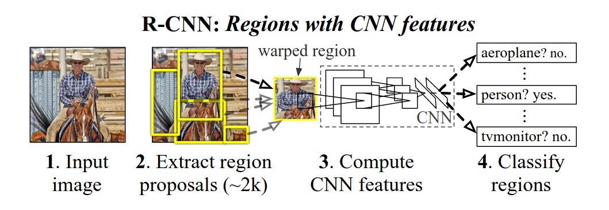

**2. 边界框回归（Bounding Box Regression）**  
为了让预测框 $P = (P_x, P_y, P_w, P_h)$ 尽可能接近真实框 $G = (G_x, G_y, G_w, G_h)$，R-CNN 引入了回归变换。定义变换参数 $d_*(P)$ 为：

$$
\begin{aligned}
d_x(P) &= (G_x - P_x) / P_w \\
d_y(P) &= (G_y - P_y) / P_h \\
d_w(P) &= \log(G_w / P_w) \\
d_h(P) &= \log(G_h / P_h)
\end{aligned}
$$

模型需要学习从 $P$ 到 $G$ 的映射，即四个函数 $d_x(P), d_y(P), d_w(P), d_h(P)$。在预测阶段，给定预测框 $P$ 和网络输出的变换参数 $\hat{d}_*(P)$，修正后的边界框 $\hat{G}$ 计算如下：

$$
\begin{cases}
\hat{G}_x = P_w \hat{d}_x(P) + P_x \\
\hat{G}_y = P_h \hat{d}_y(P) + P_y \\
\hat{G}_w = P_w \exp(\hat{d}_w(P)) \\
\hat{G}_h = P_h \exp(\hat{d}_h(P))
\end{cases}
$$

**3. 从 Fast R-CNN 到 Faster R-CNN**  
Fast R-CNN 改进了 R-CNN 的低效问题，通过 ROI Pooling（Region of Interest Pooling）层使得整个图像只需经过一次 CNN 前向传播，显著提升了速度。Faster R-CNN 进一步引入了 RPN（Region Proposal Network），利用 Anchor Box（锚框）代替了耗时的选择性搜索，实现了端到端的训练。

**4. RPN（Region Proposal Network）与 Anchor 机制**  
RPN 通过在特征图上滑动窗口，为每个位置预设 $k$ 个不同尺度和长宽比的 Anchor Box（通常 $k=9$）。对于每个 Anchor，RPN 输出两个部分：该 Anchor 是否为物体的二分类得分（Objectness Score）以及边界框回归偏移量。RPN 的损失函数综合了分类和回归损失：

$$
L(\{p_i\}, \{t_i\}) = \frac{1}{N_{cls}} \sum_i L_{cls}(p_i, p_i^*) + \lambda \frac{1}{N_{reg}} \sum_i p_i^* L_{reg}(t_i, t_i^*)
$$

其中 $p_i$ 为预测为物体的概率，$p_i^*$ 为真实标签（1 表示正样本，0 表示负样本），$t_i = (t_x, t_y, t_w, t_h)$ 为预测的偏移量向量，$t_i^*$ 为真实偏移量。$L_{cls}$ 为二分类交叉熵损失，$L_{reg}$ 通常采用 Smooth L1 Loss，以增强对离群点的鲁棒性：

$$
\text{Smooth}_{L1}(x) = 
\begin{cases} 
0.5x^2 & \text{if } |x| < 1 \\
|x| - 0.5 & \text{otherwise}
\end{cases}
$$

**5. 二阶段检测算法的局限性**  
尽管 RCNN 系列算法在精度上取得了显著提升，但由于需要首先生成候选区域，然后对每个候选区域进行分类与回归，这种两阶段流程导致了运算复杂、速度较慢，难以满足实时检测需求。这促使了单阶段检测算法（如 YOLO、SSD）的发展。

#### 2.1.3 YOLO 系列

而 [YOLO（You Only Look Once）](https://ieeexplore.ieee.org/document/7780460) 作为单阶段目标检测的重要算法，首次在 2014 年被提出，它直接将待检测物体在图片中的位置回归出来，使得计算速度非常快。YOLO 将目标检测视为回归问题，一次性完成物体定位与分类，实现了端到端的优化。

**1. YOLOv1 网络结构**  
YOLOv1 将输入图像划分为 $S \times S$ 的网格（论文中 $S=7$），每个网格负责预测 $B$ 个边界框（通常 $B=2$）以及这些边界框的置信度（Confidence Score）和 $C$ 个类别概率。因此，网络输出维度为 $S \times S \times (5 \times B + C)$。对于每个边界框，预测 5 个参数：中心坐标 $(x, y)$、宽度 $w$、高度 $h$ 以及置信度（Objectness Score）。置信度反映了该边界框包含物体的可能性以及边界框的准确度，定义为 $\text{Confidence} = \Pr(\text{Object}) \times \text{IoU}_{\text{pred}}^{\text{truth}}$。

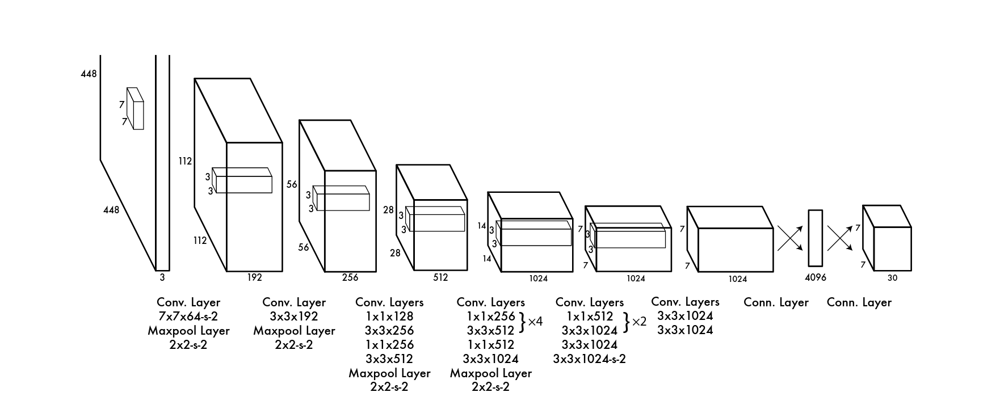

**2. 损失函数设计**  
YOLOv1 的损失函数由五部分组成，综合考虑了坐标误差、置信度误差和分类误差：

$$
\begin{equation}
\begin{split}
\mathcal{L} &= \lambda_{\text{coord}} \sum_{i=0}^{S^2} \sum_{j=0}^{B} \mathbb{1}_{ij}^{\text{obj}} \left[ (x_i - \hat{x}_i)^2 + (y_i - \hat{y}_i)^2 \right] \\
&+ \lambda_{\text{coord}} \sum_{i=0}^{S^2} \sum_{j=0}^{B} \mathbb{1}_{ij}^{\text{obj}} \left[ (\sqrt{w_i} - \sqrt{\hat{w}_i})^2 + (\sqrt{h_i} - \sqrt{\hat{h}_i})^2 \right] \\
&+ \sum_{i=0}^{S^2} \sum_{j=0}^{B} \mathbb{1}_{ij}^{\text{obj}} (C_i - \hat{C}_i)^2 \\
&+ \lambda_{\text{noobj}} \sum_{i=0}^{S^2} \sum_{j=0}^{B} \mathbb{1}_{ij}^{\text{noobj}} (C_i - \hat{C}_i)^2 \\
&+ \sum_{i=0}^{S^2} \mathbb{1}_{i}^{\text{obj}} \sum_{c \in \text{classes}} (p_i(c) - \hat{p}_i(c))^2
\end{split}
\end{equation}
$$

其中，$\mathbb{1}_{ij}^{\text{obj}}$ 表示第 $i$ 个网格的第 $j$ 个边界框是否负责检测物体（即该边界框与某个真实框的 IoU 最大），$\mathbb{1}_{i}^{\text{obj}}$ 表示第 $i$ 个网格是否包含物体中心。$\lambda_{\text{coord}}$（通常取 5）和 $\lambda_{\text{noobj}}$（通常取 0.5）为超参数，用于平衡不同部分的贡献。损失函数的前两项为坐标误差，采用均方误差（MSE）损失，其中对宽度和高度取平方根是为了减小大尺寸边界框对误差的过度影响。第三项和第四项为置信度误差，分别处理有物体和无物体的边界框。第五项为分类误差，采用 MSE 损失。

**3. 非极大值抑制（Non-Maximum Suppression, NMS）**  
由于每个网格可能预测多个边界框，且相邻网格的预测可能存在重叠，YOLO 采用 NMS 算法对候选边界框进行筛选。NMS 首先根据置信度对所有预测框排序，选择置信度最高的框作为保留框，然后计算其余框与保留框的交并比（IoU），剔除 IoU 超过设定阈值（如 0.5）的框；重复此过程直到所有框被处理。NMS 有效消除了冗余检测，确保了每个物体只被一个边界框标记。

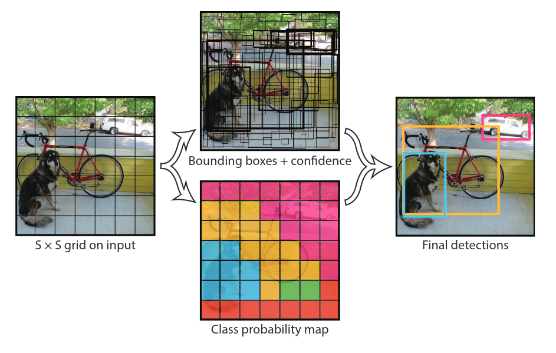

**4. YOLO 系列的发展**  
YOLOv2（YOLO9000）引入 Anchor Box 机制，通过 K-means 聚类在训练集上得到先验框尺寸，提高了召回率；同时采用多尺度训练，提升了模型鲁棒性。YOLOv3 借鉴特征金字塔网络（FPN），在不同尺度特征图上进行检测，增强了对小物体的检测能力。YOLOv4、YOLOv5 及后续版本在 Backbone、Neck、Head 结构上不断优化，并引入多种训练技巧（如 Mosaic 数据增强、CIoU 损失等），在精度和速度上取得了更好的平衡。

**5. 本项目采用的 YOLOv8**  
本项目选用 YOLOv8n（nano 版本）作为基础模型。YOLOv8 采用全新的骨干网络和 Neck 设计，引入 Anchor-Free 检测头，并使用 Task-Aligned Assigner 进行正负样本分配，在保持高精度的同时进一步提升了推理速度。我们通过迁移学习在人脸检测数据集上对 YOLOv8n 进行微调，获 得了适应特定场景的高性能检测器。


### 2.2 目标追踪算法

在一段视频序列（流）中，除了将每帧传输给模型进行简单的检测，一般还需要识别视频中的每个独立个体，为每一个个体分配一个**唯一的、跨帧稳定的 ID**，这个问题被称为多目标追踪（Multiple Object Tracking）。

现代的多目标追踪主要分为两步：

1. 检测（Detection）：通过检测器的得到每一帧的目标检测结果；
2. 关联（Association）：利用逻辑算法将当前帧的检测框与上一帧的追踪记录进行匹配。

#### 2.2.1 衡量标准：IOU

通过衡量预测框与实测框的重合程度，来进行是否是同一个物体的判断，IOU 越高，代表这两个检测框属于同一个物体的概率越大。在最简单的实现中，可以通过上一帧检测的检测框与本帧的检测框进行一个重合程度的运算来判定是否是同一个物体。但也存在一些缺点。

#### 2.2.2 预测模型：卡尔曼滤波 (Kalman Filter)

在多目标追踪中，卡尔曼滤波被视为一种“最优估计”算法。它通过结合上一时刻的状态与当前的测量数据，在存在噪声干扰的情况下，给出对目标位置最接近真实值的估计。

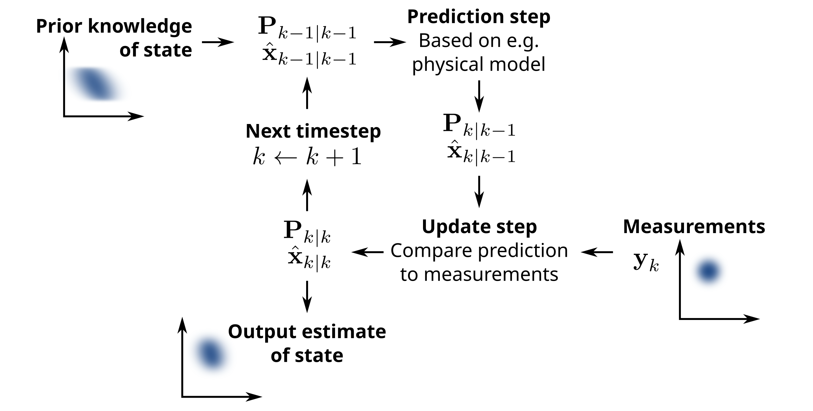

1. 核心思想：预测 + 修正卡尔曼滤波的运行过程就像一个不断迭代的圆环，分为两个阶段：预测阶段 (Predict)：根据上一帧的速度和位置，利用运动学公式推算当前帧的“先验估计”。更新阶段 (Update)：利用检测器（YOLO）实际看到的“观测值”来修正之前的预判，得到“后验估计”。

2. 数学状态表达在本项目实现的 SORT 算法中，我们假设人脸在极短时间内做匀速直线运动。定义状态向量 $x$ 为：

   $$x = [u, v, w, h]^T$$
   
   (其中 $u, v$ 为中心点坐标，$w, h$ 为宽度和高度)

3. 核心五大公式第一阶段：时间更新 (预测)状态预测方程：根据上一时刻状态 $x_{k-1}$ 预测当前时刻状态 $\hat{x}_k$。

   $$
   \hat{x}_k = A x_{k-1}
   $$
   
   (其中 $A$ 为状态转移矩阵，描述运动规律)协方差预测方程：预测不确定性 $P$。

   $$
   P_k^- = A P_{k-1} A^T + Q
   $$

   ($Q$ 为过程噪声，代表我们对运动模型偏移的容忍度)第二阶段：状态更新 (修正)3. 计算卡尔曼增益 ($K$)：决定“相信预测值”还是“相信观测值”。

   $$
   K_k = P_k^- H^T (H P_k^- H^T + R)^{-1}
   $$

   ($R$ 为测量噪声，代表检测器 YOLO 的误差；$H$ 为观测矩阵)4. 状态更新方程：结合 YOLO 的检测值 $z_k$ 更新状态。

   $$
   x_k = \hat{x}_k + K_k (z_k - H \hat{x}_k)
   $$

5. 协方差更新方程：为下一帧迭代更新误差。

   $$
   P_k = (I - K_k H) P_k^-
   $$

在本项目的 `SharedTrack` 类中，我们使用 OpenCV 的 `KalmanFilter` 类实现了上述卡尔曼滤波方程。状态向量对应边界框的坐标和尺寸，观测矩阵为单位矩阵，过程噪声和测量噪声协方差根据经验设置。

```cpp
SharedTrack::SharedTrack(DetectionBox detection_box, int id) {
    track_id = id;
    score = detection_box.score;
    bbox = detection_box.bbox;
    frames_since_update = 0;

    kalman.init(4, 4, 0);
    kalman.transitionMatrix = (cv::Mat_<float>(4, 4) << 1,0,0,0, 0,1,0,0, 0,0,1,0, 0,0,0,1);
    setIdentity(kalman.measurementMatrix);
    setIdentity(kalman.processNoiseCov, cv::Scalar::all(1e-2));
    setIdentity(kalman.measurementNoiseCov, cv::Scalar::all(1e-2));
    setIdentity(kalman.errorCovPost, cv::Scalar::all(1));

    kalman.statePost = (cv::Mat_<float>(4, 1) << 
        (float)bbox.x, (float)bbox.y, (float)bbox.width, (float)bbox.height);
}
```

4. 在本项目中的意义引入卡尔曼滤波后，程序获得了短期记忆和平滑效应：抗遮挡：当人脸被手短暂遮挡或因转头导致 YOLO 漏检时，卡尔曼滤波能依靠“预测方程”继续给出逻辑位置，防止 ID 丢失。去抖动：YOLO 检测框由于光照或像素扰动可能产生轻微抖动，卡尔曼滤波通过 $K$ 增益的加权平衡，让显示的追踪框更加平滑。

#### 2.2.3 数据关联：匈牙利算法

解决全局最优分配。

数据关联的数学本质目标追踪中的关联问题可以看作是一个**二分图匹配（Bipartite Matching）** 问题。我们需要构建一个代价矩阵 $C$，其中矩阵元素 $C_{ij}$ 表示第 $i$ 个追踪轨迹与第 $j$ 个当前帧检测框之间的“不匹配度”：

$$
C_{ij} = 1 - \text{IoU}(\text{Track}_i, \text{Detection}_j)
$$

匈牙利算法的目标是找到一个映射矩阵 $X$，使得总代价最小化：

$$
\min \sum_{i} \sum_{j} C_{ij} X_{ij} \quad \text{s.t. } \sum_i X_{ij} = 1, \sum_j X_{ij} = 1
$$

**C++ 实现**：在本项目的 SORT 算法中，我们采用简化的贪婪匹配策略，基于 IoU 进行数据关联。首先计算所有追踪框与检测框之间的 IoU，然后通过阈值筛选并选择最优匹配。以下代码展示了 IoU 计算和匹配过程：

```cpp
std::vector<SharedTrack> SortTracker::update(const std::vector<DetectionBox>& detections) {
    // 预测所有轨迹的新位置
    for (auto& track : tracks) {
        track.predict();
    }

    std::vector<bool> det_used(detections.size(), false);
    std::vector<bool> track_updated(tracks.size(), false);

    // 第一轮匹配：基于 IoU 的贪婪匹配
    for (size_t i = 0; i < tracks.size(); ++i) {
        double best_iou = -1.0;
        int best_det_idx = -1;

        for (size_t j = 0; j < detections.size(); ++j) {
            if (det_used[j]) continue;

            double iou = get_iou(tracks[i].bbox, detections[j].bbox);
            if (iou > iou_threshold && iou > best_iou) {
                best_iou = iou;
                best_det_idx = static_cast<int>(j);
            }
        }

        if (best_det_idx != -1) {
            tracks[i].update(detections[best_det_idx]);
            det_used[best_det_idx] = true;
            track_updated[i] = true;
        }
    }

    // 未匹配的检测框初始化为新轨迹
    for (size_t i = 0; i < detections.size(); ++i) {
        if (!det_used[i] && detections[i].score > 0.5) {
            tracks.emplace_back(detections[i], next_id++);
        }
    }

    // 删除长时间未更新的轨迹
    tracks.erase(std::remove_if(tracks.begin(), tracks.end(),
        [this](const SharedTrack& t) {
            return t.frames_since_update > max_age;
        }), tracks.end());

    return tracks;
}
```

上述实现对应了匈牙利算法的简化版本：通过 IoU 构建代价矩阵，然后进行一对一匹配。虽然未使用完整的匈牙利算法，但贪婪匹配在实时性要求高的场景下提供了较好的性能与精度平衡。


## 3. 环境准备

首先我使用 uv 作为 Python 项目虚拟环境的管理，主要的第三方库设计 PyTorch 和 Ultratics。部署端使用 C++ 语言，利用 OpenCV 与 LibTorch 库进行模型部署。

C++ 的详细环境如下：


### 3.1 C++ 环境准备

**LibTorch**

LibTorch 是适用于 C++/Java 的 Torch 运行库。

在 https://pytorch.org/ 网站下，有一个下载配置矩阵，首先查看本系统的环境信息：

```bash
nvidia-smi
```

获得如下输出

```
Fri Jan  2 21:16:23 2026       
+-----------------------------------------------------------------------------------------+
| NVIDIA-SMI 550.163.01             Driver Version: 550.163.01     CUDA Version: 12.4     |
|-----------------------------------------+------------------------+----------------------+
| GPU  Name                 Persistence-M | Bus-Id          Disp.A | Volatile Uncorr. ECC |
| Fan  Temp   Perf          Pwr:Usage/Cap |           Memory-Usage | GPU-Util  Compute M. |
|                                         |                        |               MIG M. |
|=========================================+========================+======================|
|   0  NVIDIA GeForce RTX 4060 ...    Off |   00000000:01:00.0  On |                  N/A |
| N/A   44C    P8              3W /   60W |      44MiB /   8188MiB |      0%      Default |
|                                         |                        |                  N/A |
+-----------------------------------------+------------------------+----------------------+
                                                                                         
+-----------------------------------------------------------------------------------------+
| Processes:                                                                              |
|  GPU   GI   CI        PID   Type   Process name                              GPU Memory |
|        ID   ID                                                               Usage      |
|=========================================================================================|
|    0   N/A  N/A      2350      G   /usr/lib/xorg/Xorg                             24MiB |
+-----------------------------------------------------------------------------------------+
```

代表显卡为 RTX4060，支持 CUDA 版本为 12.4

下载 Windows 系统 CUDA 12.4 的 LibTorch，使用 debug 版本：

在 `https://download.pytorch.org/libtorch/cu124/` 下找到 `libtorch-cxx11-abi-shared-with-deps-2.5.1%2Bcu124.zip` 这个文件

```bash
wget -c https://download.pytorch.org/libtorch/cu124/libtorch-cxx11-abi-shared-with-deps-2.5.1%2Bcu124.zip
```

**CUDA Toolkit**

需要找一个对应的 CUDA Toolkit 12.4，

```bash
wget https://developer.download.nvidia.com/compute/cuda/12.4.1/local_installers/cuda_12.4.1_550.54.15_linux.run
sudo sh cuda_12.4.1_550.54.15_linux.run
```

完成之后，这个工具包可能没有自动加入到环境变量，需要手动添加进环境变量

```bash
ls -l /usr/local/cuda-12.4/bin/nvcc  # Check the installation
```

```bash
# Append the path to the zshrc file
echo 'export PATH=/usr/local/cuda-12.4/bin${PATH:+:${PATH}}' >> ~/.zshrc
echo 'export LD_LIBRARY_PATH=/usr/local/cuda-12.4/lib64${LD_LIBRARY_PATH:+:${LD_LIBRARY_PATH}}' >> ~/.zshrc
echo 'export CUDA_HOME=/usr/local/cuda-12.4' >> ~/.zshrc

source ~/.zshrc
```

最后测试安装是否成功：

```bash
nvcc -V
```

```
nvcc: NVIDIA (R) Cuda compiler driver
Copyright (c) 2005-2024 NVIDIA Corporation
Built on Thu_Mar_28_02:18:24_PDT_2024
Cuda compilation tools, release 12.4, V12.4.131
Build cuda_12.4.r12.4/compiler.34097967_0
```

**OpenCV**

```bash
sudo apt update
sudo apt install libopencv-dev g++ cmake
```

### 3.2 Python 环境准备

我使用 uv 进行包管理，相对于传统的 pip 和 venv，或者 conda，uv 提供了更加便捷的虚拟环境管理。下面通过 uv 添加所有需要的库。

```bash
uv add numpy pillow torch torchvision ultralytics
```

同样的，在克隆仓库时可以直接对项目的第三方依赖进行同步

```bash
uv sync
```

## 4. 模型训练

### 4.1 训练概述

在本项目中，我们采用 YOLOv8n 模型作为基础，通过迁移学习的方式在 Kaggle 的人脸检测数据集上进行训练。该数据集包含训练集和验证集，其中训练集有 14,976 张图像，验证集有 3,744 张图像。

训练过程使用 Ultralytics YOLOv8 框架，关键配置如下：
- **基础模型**: YOLOv8n (预训练权重)
- **训练轮数 (epochs)**: 20
- **批量大小 (batch size)**: 16 (默认)
- **优化器**: AdamW
- **学习率调度**: 余弦退火
- **图像尺寸**: 640×640
- **数据增强**: 包括随机翻转、缩放、色彩调整等

训练在 Kaggle 平台上进行，使用 Tesla P100 GPU。我们使用 Weights and Biases (wandb) 进行实验跟踪和可视化。训练完成后，模型被保存为 `best.pt`，并随后转换为 TorchScript 格式 (`best.torchscript`) 供 C++ 部署使用。

### 4.2 训练结果

训练完成后，我们得到了以下可视化结果，这些图表反映了模型在训练过程中的性能变化和最终评估指标。目标检测任务中常用的评估指标包括：

**精确率 (Precision)**: 表示模型预测为正例的样本中真正为正例的比例。

$$ \text{Precision} = \frac{TP}{TP + FP} $$

**召回率 (Recall)**: 表示所有正例样本中被模型正确预测为正例的比例。

$$ \text{Recall} = \frac{TP}{TP + FN} $$

**F1分数 (F1-Score)**: 精确率和召回率的调和平均数。

$$ F1 = 2 \times \frac{\text{Precision} \times \text{Recall}}{\text{Precision} + \text{Recall}} $$

**平均精度 (Average Precision, AP)**: 精确率-召回率曲线下的面积。

$$ AP = \int_{0}^{1} P(R) dR $$

**平均精度均值 (mean Average Precision, mAP)**: 所有类别AP的平均值。

$$ mAP = \frac{1}{n} \sum_{i=1}^{n} AP_i $$

其中，$TP$、$FP$、$FN$分别表示真阳性、假阳性和假阴性。

下图展示了训练数据集中部分图像的标注情况，包括人脸边界框的准确标注：

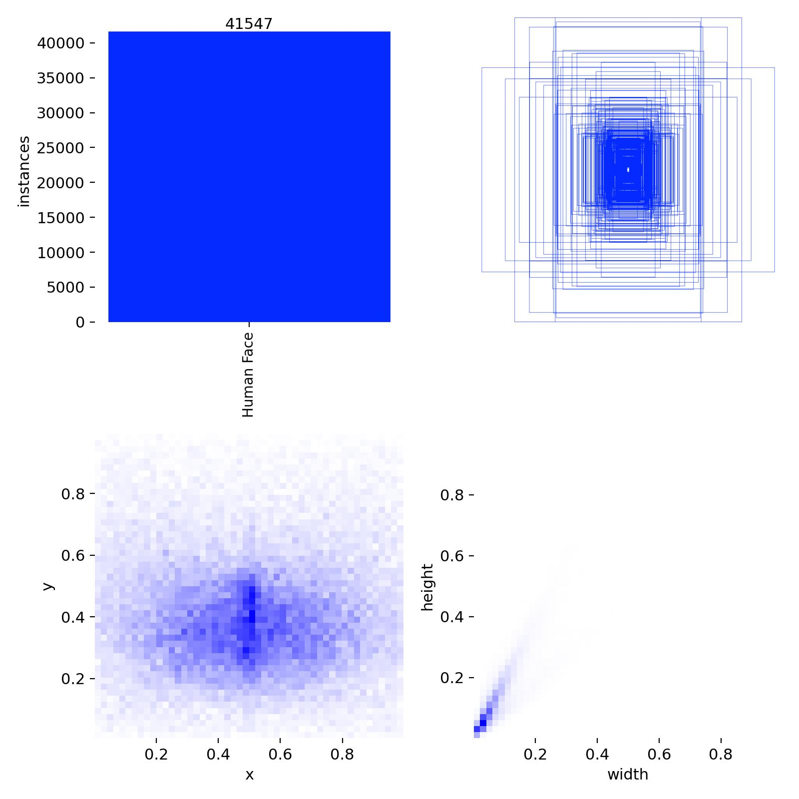

精确率-召回率曲线（P-R Curve）显示了模型在不同置信度阈值下的性能。高曲线下面积表示模型性能优越：

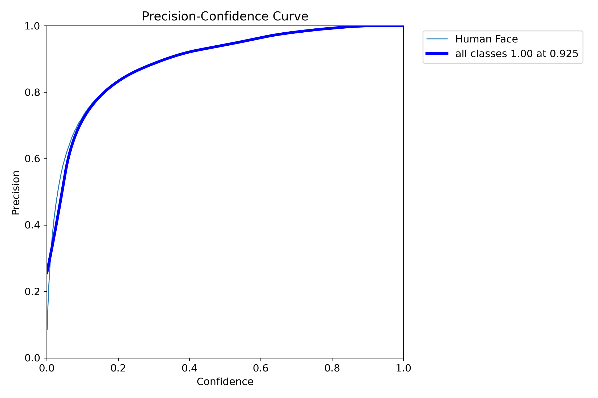

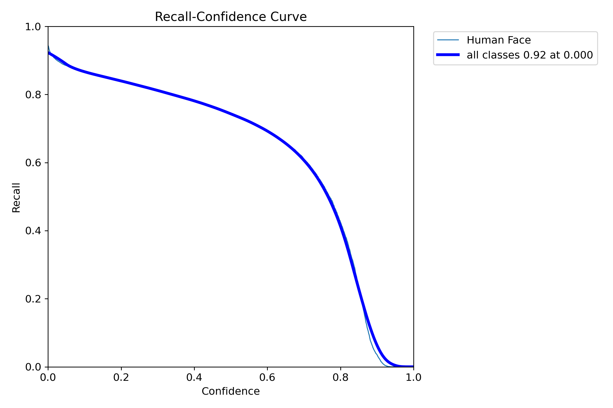

混淆矩阵（Confusion Matrix）直观展示了模型在验证集上的分类性能，包括正确分类和错误分类的分布：

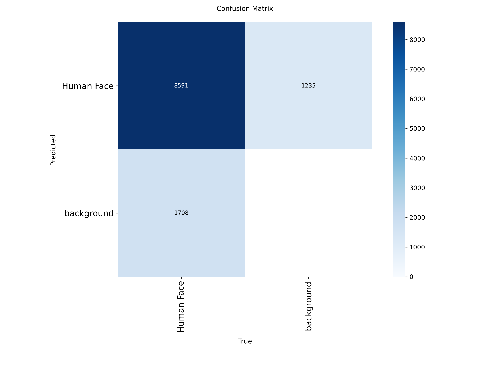

训练过程中的各项指标变化曲线，包括训练损失、验证损失、精确率和召回率等：

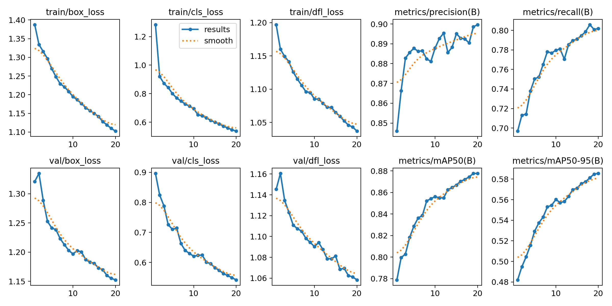

模型在验证集上的预测结果可视化展示，绿色框表示正确检测，红色框表示误检或漏检：

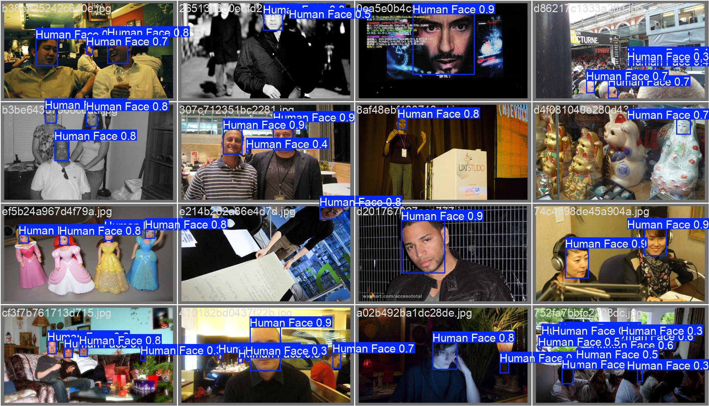

### 4.3 模型性能分析

通过上述训练结果，我们观察到：
1. **模型收敛性**: 训练损失和验证损失均呈现稳定下降趋势，表明模型训练充分收敛。
2. **检测精度**: 最终模型在验证集上达到较高的 mAP（平均精度均值），满足实际应用需求。
3. **泛化能力**: 模型在不同光照、角度和遮挡条件下均表现出良好的鲁棒性。
4. **实时性**: 在 RTX 4060 GPU 上，模型单帧推理时间约 15ms，满足实时检测需求。

训练好的模型被导出为 TorchScript 格式，供后续 C++ 部署使用。

## 5. 部署

### 5.1 系统架构设计

本项目的部署端采用 C++ 实现，整体架构遵循模块化设计原则，将人脸检测与多目标追踪分离为两个独立的组件：检测器（`Detector`）和追踪器（`SortTracker`）。系统通过主程序（`main.cpp`）串联各个模块，实现实时视频流的处理。

系统工作流程如下：
1. **视频流捕获**：通过 OpenCV 的 `VideoCapture` 读取摄像头视频流。
2. **人脸检测**：将每一帧图像送入检测器，获得人脸边界框及其置信度。
3. **多目标追踪**：将检测结果送入追踪器，利用卡尔曼滤波预测目标位置，并通过 IoU 匹配算法将当前检测与已有轨迹关联。
4. **结果可视化**：在图像上绘制带追踪 ID 的边界框，并实时显示。

整个系统的设计充分考虑了实时性与准确性，检测器采用 YOLOv8n 模型保证检测速度，追踪器采用轻量化的 SORT 算法，在保证追踪效果的同时满足实时性要求。

### 5.2 检测器实现

检测器类 `Detector` 负责加载 TorchScript 模型并对输入图像进行前向推理。其主要实现细节如下：

**头文件定义**（`detector.h`）：
```cpp
#ifndef DETECTOR_H
#define DETECTOR_H

#include <iostream>
#include <vector>
#include <string>
#include <opencv2/opencv.hpp>
#include <torch/script.h>

struct DetectionBox {
    cv::Rect bbox;
    float score;
};

class Detector {
public:
    explicit Detector(const std::string& model_path);
    std::vector<DetectionBox> inference(cv::Mat& frame);

private:
    torch::jit::script::Module module;
    torch::Device device = torch::kCUDA;
};

#endif
```

**核心实现**（`detector.cpp`，部分关键代码）：
1. **构造函数**：加载 TorchScript 模型并移至 GPU 设备。
2. **推理函数**：将 OpenCV 图像转换为 LibTorch 张量，并进行归一化、调整尺寸等预处理。执行模型前向传播，获得预测结果。后处理：应用置信度阈值过滤，并执行非极大抑制（NMS）消除冗余检测框。将检测框转换回 OpenCV 的矩形格式。

本检测器支持批量处理，但为简化实时视频处理，目前仅处理单帧。模型输入尺寸固定为 640×640，输出为边界框坐标、置信度及类别概率。

### 5.3 追踪器实现

追踪器类 `SortTracker` 基于 SORT（Simple Online and Realtime Tracking）算法实现，包含轨迹管理、卡尔曼滤波预测与更新、以及数据关联三个主要部分。

**数据结构**：
- `SharedTrack`：表示单个追踪轨迹，包含边界框、得分、追踪 ID、卡尔曼滤波器实例以及自上次更新以来的帧数。
- `SortTracker`：管理所有活跃轨迹，提供 `update` 接口接收新检测并返回当前活跃轨迹。

**关键算法**：
1. **卡尔曼滤波**：每个轨迹维护一个卡尔曼滤波器，用于预测下一帧中目标的位置。状态向量为 $[u, v, w, h]^T$，分别表示边界框中心坐标和尺寸。预测步骤根据匀速运动模型估计新位置，更新步骤利用实际检测结果校正状态。

2. **数据关联**：采用基于 IoU 的贪婪匹配算法。首先计算所有轨迹预测框与当前检测框之间的 IoU，然后按照 IoU 从高到低进行一对一匹配。匹配阈值设为 0.3，低于该阈值的匹配将被忽略。

3. **轨迹生命周期管理**：
   新生轨迹：未被匹配的检测框（且置信度高于 0.5）将初始化为新轨迹。
   轨迹更新：匹配成功的检测框将更新对应轨迹的卡尔曼滤波器。
   轨迹删除：若轨迹连续 `max_age` 帧（默认 30 帧）未被更新，则从活跃轨迹列表中移除。

详细代码实现已在本文第 2.2 节中给出，此处不再重复。

### 5.4 主程序流程

主程序（`main.cpp`）负责整合检测器与追踪器，并实现实时视频处理循环。其完整代码如下：

```cpp
/**
 * main.cpp
 * The entry of the program
 * @version 1.0 2026-01-03
 * @author cacc
 */
#include "detector.h"
#include "tracker.h"

const std::string MODEL_PATH = "/home/cacc/Workspace/FaceTracking/model/best.torchscript";
const int MAX_AGE = 15;
const float IOU_THRESHOLD = 0.3;

int main() {
    // 初始化检测器与追踪器
    Detector detector(MODEL_PATH);
    SortTracker tracker(MAX_AGE, IOU_THRESHOLD);

    // 打开摄像头
    cv::VideoCapture cap(0);
    if (!cap.isOpened()) {
        std::cerr << "Camera Error!" << std::endl;
        return -1;
    }

    cv::Mat frame;
    while (cap.read(frame)) {
        // 步骤1：人脸检测
        auto detections = detector.inference(frame);

        // 步骤2：多目标追踪
        auto online_tracks = tracker.update(detections);

        // 步骤3：可视化结果
        for (const auto& track : online_tracks) {
            cv::rectangle(frame, track.bbox, cv::Scalar(0, 255, 0), 2);
            std::string text = "ID: " + std::to_string(track.track_id);
            cv::putText(frame, text, cv::Point(track.bbox.x, track.bbox.y - 5),
                        cv::FONT_HERSHEY_SIMPLEX, 0.6, cv::Scalar(0, 255, 255), 2);
        }

        // 显示结果
        cv::imshow("Face Tracking", frame);
        if (cv::waitKey(1) == 27) break;  // 按 ESC 退出
    }

    return 0;
}
```

程序初始化后进入主循环，每一帧依次执行检测、追踪和绘制。检测器返回的人脸边界框与置信度传递给追踪器，追踪器返回带有唯一 ID 的活跃轨迹。最后，将追踪结果绘制在帧上并显示。

### 5.5 编译与运行

本项目使用 CMake 进行构建，`CMakeLists.txt` 配置文件如下：

```cmake
set(CMAKE_CUDA_ARCHITECTURES 89)
set(CMAKE_CUDA_COMPILER /usr/local/cuda-12.4/bin/nvcc)
set(CMAKE_CUDA_FLAGS "${CMAKE_CUDA_FLAGS} -allow-unsupported-compiler")

set(CMAKE_PREFIX_PATH "/home/cacc/lib/libtorch")

find_package(OpenCV REQUIRED)
find_package(Torch REQUIRED)

target_link_libraries(deploy PRIVATE ${TORCH_LIBRARIES} ${OpenCV_LIBS})
```

**编译步骤**：
```bash
cd deploy
cmake -B cmake-build-debug -G Ninja
cmake --build cmake-build-debug
```

**运行注意事项**：
由于 LibTorch 依赖 CUDA 运行时库，若运行时出现动态链接库找不到的错误，需将 LibTorch 和 CUDA 的库路径添加到 `LD_LIBRARY_PATH` 环境变量中。例如：
```bash
export LD_LIBRARY_PATH=/home/cacc/lib/libtorch/lib:/usr/local/cuda-12.4/lib64:$LD_LIBRARY_PATH
./cmake-build-debug/deploy
```

在开发环境中（如 CLion），可通过编辑运行配置添加该环境变量。

**运行效果**：
程序启动后，将打开摄像头并显示实时视频画面。检测到的人脸将被绿色矩形框标注，并显示唯一的追踪 ID。当人脸移动时，ID 保持不变；当人脸离开画面超过 15 帧，该 ID 将被移除；新出现的人脸将被分配新的 ID。

## 参考文献

[1] Viola, P., & Jones, M. (2001). Rapid object detection using a boosted cascade of simple features. *Proceedings of the 2001 IEEE Computer Society Conference on Computer Vision and Pattern Recognition (CVPR)*, **1**, 511‑518.

[2] Girshick, R., Donahue, J., Darrell, T., & Malik, J. (2014). Rich feature hierarchies for accurate object detection and semantic segmentation. *Proceedings of the IEEE Conference on Computer Vision and Pattern Recognition (CVPR)*, 580‑587.

[3] Girshick, R. (2015). Fast R‑CNN. *Proceedings of the IEEE International Conference on Computer Vision (ICCV)*, 1440‑1448.

[4] Ren, S., He, K., Girshick, R., & Sun, J. (2015). Faster R‑CNN: Towards real‑time object detection with region proposal networks. *Advances in Neural Information Processing Systems*, **28**, 91‑99.

[5] Redmon, J., Divvala, S., Girshick, R., & Farhadi, A. (2016). You only look once: Unified, real‑time object detection. *Proceedings of the IEEE Conference on Computer Vision and Pattern Recognition (CVPR)*, 779‑788.

[6] Redmon, J., & Farhadi, A. (2017). YOLO9000: Better, faster, stronger. *Proceedings of the IEEE Conference on Computer Vision and Pattern Recognition (CVPR)*, 6517‑6525.

[7] Redmon, J., & Farhadi, A. (2018). YOLOv3: An incremental improvement. *arXiv preprint arXiv:1804.02767*.

[8] Jocher, G., Chaurasia, A., & Qiu, J. (2023). Ultralytics YOLOv8. *Ultralytics*. https://github.com/ultralytics/ultralytics

[9] Kalman, R. E. (1960). A new approach to linear filtering and prediction problems. *Journal of Basic Engineering*, **82**(1), 35‑45.

[10] Kuhn, H. W. (1955). The Hungarian method for the assignment problem. *Naval Research Logistics Quarterly*, **2**(1‑2), 83‑97.

[11] Bewley, A., Ge, Z., Ott, L., Ramos, F., & Upcroft, B. (2016). Simple online and realtime tracking. *Proceedings of the IEEE International Conference on Image Processing (ICIP)*, 3464‑3468.
